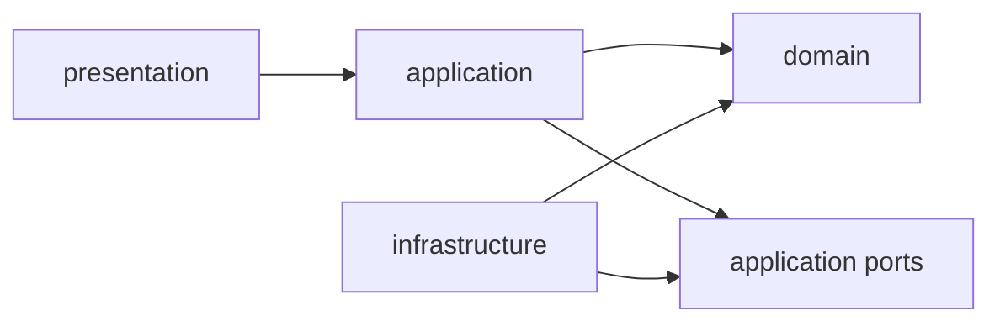

# Architecture

Project code is grouped by Clean Architecture layers under
`ru.spb.reshenie.chekerstatus`.

## Layers

- `domain` contains business data structures, value objects, enums, and small
  pure helpers. It must not depend on Spring, JDBC, HTTP clients, or Thymeleaf.
- `application` contains use cases and orchestration services. It coordinates
  domain objects through application ports, but keeps infrastructure and
  web/controller concerns out.
- `infrastructure` contains adapters for external systems and technical details:
  Spring configuration, JDBC repositories, GitLab/NSI clients, persistence code.
- `presentation` contains HTTP/UI code: MVC controllers, API controllers,
  Thymeleaf read models, and UI formatting helpers.

## Current Package Map

- `domain.common` - shared pure helpers.
- `domain.gitlab` - GitLab synchronization model and results.
- `domain.nsi` - NSI dictionary/passport/record model.
- `domain.sync` - synchronization run history model.
- `application.gitlab` - Git synchronization use cases.
- `application.gitlab.port` - GitLab ports required by use cases.
- `application.nsi` - NSI synchronization use cases and scheduler.
- `application.nsi.port` - NSI ports and sync settings required by use cases.
- `application.sync` - synchronization run lifecycle service.
- `application.sync.port` - synchronization run history port.
- `infrastructure.config` - Spring Boot configuration and properties.
- `infrastructure.gitlab` - GitLab HTTP/persistence adapters.
- `infrastructure.nsi` - NSI HTTP/persistence adapters.
- `infrastructure.persistence` - synchronization history persistence.
- `presentation.web` - dashboard API, Thymeleaf controllers, UI read models.

## Dependency Rule

Inner layers should not know about outer layers:

Application services depend on ports and domain models. Infrastructure adapters
implement those ports and keep Spring/JDBC/HTTP details outside the use cases.
